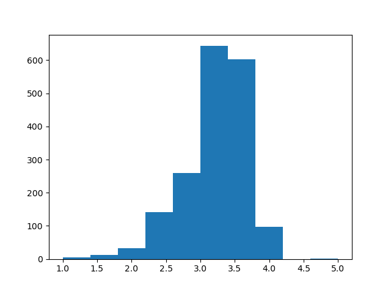

# Scrapping-Web-with-Python

A series of web scraping projects from courses and personal interests using Python BeautifulSoup

## [#1 Chocolate Ratings](https://github.com/emmanguyen102/Scraping-Web-with-Python/blob/master/chocolate_ratings.py) Scrapping from table 
The aim was to see which 10 chocolate companies had the best ratings and whether the cocoa percentage affected the ratings.
The table contains 1795 data points, with 3 important columns for analysis: Company, Rating and Cocoa Percent. The results found as following:
- The highest rating scrapped was 4.  

- The cocoa does have influence on ratings. 
